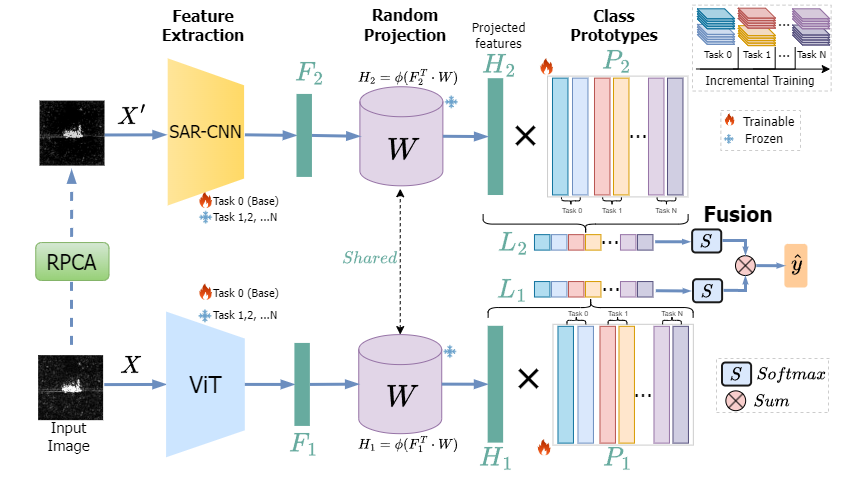
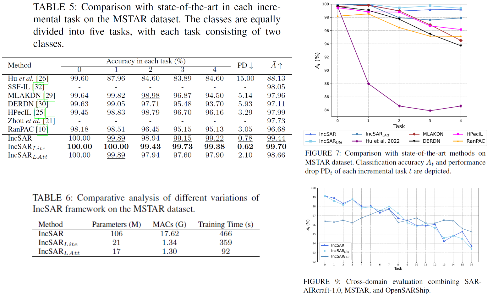

# IncSAR: A dual fusion incremental learning framework for SAR Target Recognition
The implementation of IEEE Access paper IncSAR: A dual fusion incremental learning framework for SAR Target Recognition.

**If you use any code of this repo for your work, please cite the following bib entries:**
```
@article{,
  title={IncSAR: A Dual Fusion Incremental Learning Framework for SAR Target Recognition},
  author={Karantaidis, George and Pantsios, Athanasios and Kompatsiaris, Yiannis and Papadopoulos, Symeon},
  journal={IEEE Access},
  year={2025},
  publisher={IEEE}
}
```
## Pipeline



## Install
```
conda create -n incsar python=3.9
conda activate incsar
pip install -r requirements.txt
```
## Dependencies 
This code is implemented in PyTorch, and we perform the experiments under the following environment settings:
```
torch==2.0.1
torchvision==0.15.2
timm==0.6.12
Pillow==10.3.0
scikit_learn
scipy
tqdm
numpy==1.26.4
```

## Results


## Dataset preparation
- Create a folder "datasets/" under the root directory.
- MSTAR: download the folder MSTAR from [link](https://itigr-my.sharepoint.com/:f:/g/personal/karantai_iti_gr/EkURhx1iLLZPoLmgp02-v4IBq6AXDQrOw7064ZtjvlrW4A?e=4dt8hb) and place them into the 'datasets/' folder
- MSTAR_OPENSAR: download the folder MSTAR_OPENSAR from [link](https://itigr-my.sharepoint.com/:f:/g/personal/karantai_iti_gr/EkURhx1iLLZPoLmgp02-v4IBq6AXDQrOw7064ZtjvlrW4A?e=4dt8hb) and place them into the 'datasets/' folder
- SAR-AIRcraft-1.0: download the folder AIRCRAFT [link](https://itigr-my.sharepoint.com/:f:/g/personal/karantai_iti_gr/EkURhx1iLLZPoLmgp02-v4IBq6AXDQrOw7064ZtjvlrW4A?e=4dt8hb) and place them into the 'datasets/' folder

## Run experiments: 
### Basic experiments
```
bash ./exps/basic_experiments/basic_experiments.sh
```
### Cross domain experiments
```
bash ./exps/cross_domain/cross_domain.sh
```
### Ablation Studies
- Contribution analysis of IncSAR module
```
bash ./exps/exps_ablation_components/ablation_components.sh
```
- Comparative analysis of backbone network
```
bash ./exps/exps_ablation_backbones/ablation_backbones.sh
```
- IncSAR evaluation on limited data scenario
```
bash ./exps/exps_ablation_portion/ablation_portion.sh
```

## Acknowledgments 
We thank the following repos providing helpful components/functions in our work.
- [PILOT](https://github.com/sun-hailong/LAMDA-PILOT)
- [RanPAC](https://github.com/RanPAC/RanPAC/)
- [TinyViT](https://github.com/wkcn/TinyViT)
- [SSF](https://github.com/dongzelian/SSF)

You should also cite the following:

MSTAR dataset:
```
@inproceedings{ross1998standard,
  title={Standard SAR ATR evaluation experiments using the MSTAR public release data set},
  author={Ross, Timothy D and Worrell, Steven W and Velten, Vincent J and Mossing, John C and Bryant, Michael Lee},
  booktitle={Algorithms for synthetic aperture radar imagery V},
  volume={3370},
  pages={566--573},
  year={1998},
  organization={SPIE}
}
```

OpenSARShip dataset:
```
@article{huang2017opensarship,
  title={OpenSARShip: A dataset dedicated to Sentinel-1 ship interpretation},
  author={Huang, Lanqing and Liu, Bin and Li, Boying and Guo, Weiwei and Yu, Wenhao and Zhang, Zenghui and Yu, Wenxian},
  journal={IEEE Journal of Selected Topics in Applied Earth Observations and Remote Sensing},
  volume={11},
  number={1},
  pages={195--208},
  year={2017},
  publisher={IEEE}
}
```

SarAircraft dataset:
```
@article{zhirui2023sar,
  title={SAR-AIRcraft-1.0: High-resolution SAR aircraft detection and recognition dataset},
  author={Zhirui, Wang and Yuzhuo, Kang and Xuan, Zeng and Yuelei, WANG and Ting, ZHANG and Xian, SUN},
  journal={雷达学报},
  volume={12},
  number={4},
  pages={906--922},
  year={2023},
  publisher={雷达学报}
}
```

## Contact
If there are any questions, please feel free to contact the author George Karantaidis (karantai@iti.gr).
